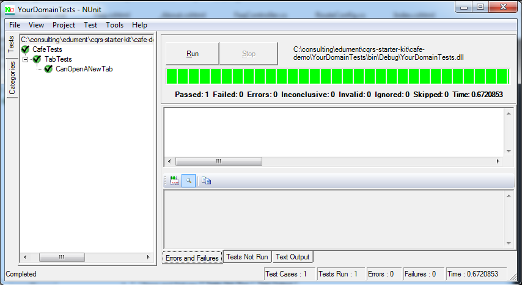

# Part 2: Domain Logic

## Our First Command and Event

All scenarios start with the opening of a tab, so we'll start there. First, we define the TabOpened event. It has a unique ID for the tab being opened, the table number the customers are located at, and the waiter(ess) who is serving the table.

```csharp
public class TabOpened
{
    public Guid Id;
    public int TableNumber;
    public string Waiter;
}
```

None of the infrastructure in the starter kit requires events to inherit from a particular base class. The only requirement comes from its various event store bindings, **which require a field `Id` of type Guid**.

The command looks very similar, in this particular case:

```csharp
public class OpenTab
{
    public Guid Id;
    public int TableNumber;
    public string Waiter;
}
```

Once again, there is no inheritance requirement, but we again **require a field `Id` of type Guid**, to identify the aggregate the command is aimed at.

On conventions, you may wonder whether we should suffix our command and event type names with Command and Event. The answer is that no, it just creates noise. It turns out that humans are really rather good at knowing if a verb is an imperative ("Cook me a spicy burrito!") or in the past tense ("I cooked you a spicy burrito, but then my chihuahua ate it").

## Building Our First Test

Before we can write tests, we need to declare a class for our aggregate.

```csharp
public class TabAggregate : Aggregate
{
}
```

The only requirement here is that `TabAggregate` inherit from `Aggregate`. The `Aggregate` base class holds the aggregate's ID and a little infrastructure related to event application.

At this point we're ready to stub in a test class and write an initial test.

```csharp
[TestFixture]
public class TabTests : BDDTest<TabAggregate>
{
    private Guid testId;
    private int testTable;
    private string testWaiter;

    [SetUp]
    public void Setup()
    {
        testId = Guid.NewGuid();
        testTable = 42;
        testWaiter = "Derek";
    }

    [Test]
    public void CanOpenANewTab()
    {
        Test(
            Given(),
            When(new OpenTab
            {
                Id = testId,
                TableNumber = testTable,
                Waiter = testWaiter
            }),
            Then(new TabOpened
            {
                Id = testId,
                TableNumber = testTable,
                Waiter = testWaiter
            }));
    }
}
```

The test says that given we have no event history for the tab, when an `OpenTab` command is issued, then we expect a `TabOpened` event to be produced.

By now, our solution structure looks something like this.


## From Fail to Pass

We can already run our first test. And, predictably, it fails.


Happily, however, the error it fails with gives us a big hint what to do next:

`CafeTests.TabTests.CanOpenANewTab`: Aggregate TabAggregate does not yet handle command OpenTab

Adding a command handler involves implementing the generic IHandleCommand interface. It should be parameterized with the command to handle. Note that `Ctrl +`. can be used to create a stub Handle method.

```csharp
public class TabAggregate : Aggregate,
    IHandleCommand<OpenTab>
{
    public IEnumerable Handle(OpenTab c)
    {
        yield return new TabOpened
        {
            Id = c.Id,
            TableNumber = c.TableNumber,
            Waiter = c.Waiter
        };
    }
}
```

The implementation of the command handler for `OpenTab` is straightforward; it simply produces a `TabOpened` event. Note that it uses yield to make it easy for a command handler to produce zero or many events as well as just one, like in this case. And with this, the test passes.



## Taking Orders

Next, we'll look at the process of taking orders. First up, we'll define the `DrinksOrdered` and `FoodOrdered` events.

```csharp
public class OrderedItem
{
    public int MenuNumber;
    public string Description;
    public bool IsDrink;
    public decimal Price;
}

public class DrinksOrdered
{
    public Guid Id;
    public List<OrderedItem> Items;
}

public class FoodOrdered
{
    public Guid Id;
    public List<OrderedItem> Items;
}
```

They share the `OrderedItem` class. While it is important that events remain independent of each other, re-use of this kind is not problematic.

The command is unsurprising:

```csharp
public class PlaceOrder
{
    public Guid Id;
    public List<OrderedItem> Items;
}
```

Now for the test. The tab should be opened before placing an order. At this point, we realize that we didn't identify that failure mode earlier. That's fine; the process of writing tests often brings about such clarifications. So we add an exception type:

```csharp
public class TabNotOpen : Exception
{
}
```

You can create a file per exception type, but it can be much less clutter to create an `Exceptions.cs` and put all of the exceptions for an aggregate into it. Next, we write a test:

```csharp
[Test]
public void CanNotOrderWithUnopenedTab()
{
    Test(
        Given(),
        When(new PlaceOrder
        {
            Id = testId,
            Items = new List<OrderedItem> { testDrink1 }
        }),
        ThenFailWith<TabNotOpen>());
}
```

The failure mode of the test:

`CafeTests.TabTests.CanNotOrderWithUnopenedTab`: Aggregate TabAggregate does not yet handle command PlaceOrder

Guides us to add a command handler (by implementing `IHandleCommand<T>`), which for now can always throw, since this is the minimum needed to pass the test.

```csharp
public IEnumerable Handle(PlaceOrder c)
{
    throw new TabNotOpen();
}
```

With that detail taken care of, now it's time to write some more interesting tests. We map out three cases of ordering: just drinks, just food, and a mix of food and drink. We want to make sure that items are categorized into the correct events, and that empty drink or food order events are not emitted.

```csharp
[Test]
public void CanPlaceDrinksOrder()
{
    Test(
        Given(new TabOpened
        {
            Id = testId,
            TableNumber = testTable,
            Waiter = testWaiter
        }),
        When(new PlaceOrder
        {
            Id = testId,
            Items = new List<OrderedItem> { testDrink1, testDrink2 }
        }),
        Then(new DrinksOrdered
        {
            Id = testId,
            Items = new List<OrderedItem> { testDrink1, testDrink2 }
        }));
}

[Test]
public void CanPlaceFoodOrder()
{
    Test(
        Given(new TabOpened
        {
            Id = testId,
            TableNumber = testTable,
            Waiter = testWaiter
        }),
        When(new PlaceOrder
        {
            Id = testId,
            Items = new List<OrderedItem> { testFood1, testFood1 }
        }),
        Then(new FoodOrdered
        {
            Id = testId,
            Items = new List<OrderedItem> { testFood1, testFood1 }
        }));
}

[Test]
public void CanPlaceFoodAndDrinkOrder()
{
    Test(
        Given(new TabOpened
        {
            Id = testId,
            TableNumber = testTable,
            Waiter = testWaiter
        }),
        When(new PlaceOrder
        {
            Id = testId,
            Items = new List<OrderedItem> { testFood1, testDrink2 }
        }),
        Then(new DrinksOrdered
        {
            Id = testId,
            Items = new List<OrderedItem> { testDrink2 }
        },
        new FoodOrdered
        {
            Id = testId,
            Items = new List<OrderedItem> { testFood1 }
        }));
}
```

All three of our new tests fail in the same way:

`CafeTests.TabTests.CanPlaceDrinksOrder`: Aggregate TabAggregate does not know how to apply event TabOpened

Now that we have tests with events in the given section, we have history. The aggregate plays an important role in turning that event history into a representation of current state. It does so by implementing the generic `IApplyEvent` interface for each relevant event type. The `Apply` method it requires should update the aggregate's state based on the event and its data. In this particular case, we don't actually care about the content of the event, just that it has taken place.

```csharp
public class TabAggregate : Aggregate,
    IHandleCommand<OpenTab>,
    IHandleCommand<PlaceOrder>,
    IApplyEvent<TabOpened>
{
    private bool open = false;

    // Command handlers, omitted for brevity

    public void Apply(TabOpened e)
    {
        open = true;
    }
}
```

With this in place, the tests all fail in a new way:

`CafeTests.TabTests.CanPlaceDrinksOrder`: Expected events, but got exception TabNotOpen

At which point we realize - ah, of course, we made our command handler throw that exception always. Now we can go back and fill it out properly, making our tests pass.

```csharp
public IEnumerable Handle(PlaceOrder c)
{
    if (!open)
        throw new TabNotOpen();

    var drink = c.Items.Where(i => i.IsDrink).ToList();
    if (drink.Any())
        yield return new DrinksOrdered
        {
            Id = c.Id,
            Items = drink
        };

    var food = c.Items.Where(i => !i.IsDrink).ToList();
    if (food.Any())
        yield return new FoodOrdered
        {
            Id = c.Id,
            Items = food
        };
}
```

Note that the test runner ensures that the events from the given are all applied to the aggregate before the command in the when runs. Later, we'll see that in a production scenario, the same happens - but the events to apply are loaded from a persistent **event store** and the produced events are then persisted into it.

## Serving - and a Pattern of Intentful Testing

Next up, we'll consider the process of serving drinks. The event produced is DrinksServed, while the command is `MarkDrinksServed`. This event reflects the domain's view (some drinks were served, and I want to incorporate this fact into the system) and the user's view (I just gave the customer these drinks, and now I want to mark that part of the order as served).

Defining the event is straightforward:

```csharp
public class DrinksServed
{
    public Guid Id;
    public List<int> MenuNumbers;
}
```

As is the command:

```csharp
public class MarkDrinksServed
{
    public Guid Id;
    public List<int> MenuNumbers;
}
```

The testing is less obvious, however. Clearly, we can write a test like this:

```csharp
[Test]
public void OrderedDrinksCanBeServed()
{
    Test(
        Given(new TabOpened
        {
            Id = testId,
            TableNumber = testTable,
            Waiter = testWaiter
        },
        new DrinksOrdered
        {
            Id = testId,
            Items = new List<OrderedItem> { testDrink1, testDrink2 }
        }),
        When(new MarkDrinksServed
        {
            Id = testId,
            MenuNumbers = new List<int>
                { testDrink1.MenuNumber, testDrink2.MenuNumber }
        }),
        Then(new DrinksServed
        {
            Id = testId,
            MenuNumbers = new List<int>
                { testDrink1.MenuNumber, testDrink2.MenuNumber }
        }));
}
```

Naively, you could say that we have now tested the MarkDrinksServed command. However, have we really? Let's see what we need to do to make this test pass. The first reason the test fails is because of a missing event applier:

`CafeTests.TabTests.OrderedDrinksCanBeServed`: Aggregate TabAggregate does not know how to apply event DrinksOrdered

Adding a no-op handler is enough to resolve this:

```csharp
public void Apply(DrinksOrdered e)
{
}
```

With that out of the way, the test now fails with:

`CafeTests.TabTests.OrderedDrinksCanBeServed`: Aggregate TabAggregate does not yet handle command MarkDrinksServed

This can be fixed with a command handler that simply issues the event.

```csharp
public IEnumerable Handle(MarkDrinksServed c)
{
    yield return new DrinksServed
    {
        Id = c.Id,
        MenuNumbers = c.MenuNumbers
    };
}
```

The test does now pass, but it's somehow unsatisfying. It's almost as if we have cheated: we got a passing test, but we've not actually written any logic related to tracking the ordered drinks and recording their serving. In fact, all our test really seems to assert is that we can turn a simple command into a simple event by copying some fields from one to the other. Wow!


So how can we write tests that check we've actually written the required domain logic? The answer typically lies in the sad paths: the tests that result in an exception rather than events. For example, we can write tests that ensure:

* You can not mark a drink as served if it wasn't ordered in the first place
* You can not mark a drink as served if you already served it

Collectively, you can't serve a drink that is not still outstanding in the order. This leads us to a new exception type:

```csharp
public class DrinksNotOutstanding : Exception
{
}
```

One could argue that a well-behaved UI should never let the user make this mistake. However, we may be in a multi-agent system (where somehow, multiple table staff end up both trying to serve the drink), in which case there is a race that we need to cope with in the aggregate. But even putting that aside, our domain logic should treat the sender of commands with a degree of distrust. Responsibility for maintaining the integrity of the domain state lies with the aggregate's command handlers, which serve as a domain gatekeeper.

Having defined our new exception, we can now write a more interesting test:

```csharp
[Test]
public void CanNotServeAnUnorderedDrink()
{
    Test(
        Given(new TabOpened
        {
            Id = testId,
            TableNumber = testTable,
            Waiter = testWaiter
        },
        new DrinksOrdered
        {
            Id = testId,
            Items = new List<OrderedItem> { testDrink1 }
        }),
        When(new MarkDrinksServed
        {
            Id = testId,
            MenuNumbers = new List<int> { testDrink2.MenuNumber }
        }),
        ThenFailWith<DrinksNotOutstanding>());
}
```

Essentially, this means that we can not mark our second test drink as served if the order was for our first test drink. The test fails:

`CafeTests.TabTests.CanNotServeAnUnorderedDrink`: Expected exception DrinksNotOutstanding, but got event result

To fix it, we have our aggregate start tracking the drinks that are still outstanding:

```csharp
private List<int> outstandingDrinks = new List<int>();

public void Apply(DrinksOrdered e)
{
    outstandingDrinks.AddRange(e.Items.Select(i => i.MenuNumber));
}
```

We also need a way to check that a set of drinks to be served are in the outstanding list. This can be implemented by **making a copy**of the outstanding items, and then making sure we can remove each of the ones we wish to serve. We could write this logic directly in the command handler, but it's neater to capture it in a private method:

```csharp
private bool AreDrinksOutstanding(List<int> menuNumbers)
{
    var curOutstanding = new List<int>(outstandingDrinks);
    foreach (var num in menuNumbers)
        if (curOutstanding.Contains(num))
            curOutstanding.Remove(num);
        else
            return false;
    return true;
}
```

Finally, the command handler is updated to use this method to validate the command:

```csharp
public IEnumerable Handle(MarkDrinksServed c)
{
    if (!AreDrinksOutstanding(c.MenuNumbers))
        throw new DrinksNotOutstanding();

    yield return new DrinksServed
    {
        Id = c.Id,
        MenuNumbers = c.MenuNumbers
    };
}
```

So, now we've tested that ordering drinks actually means something. But what about the serving? By now, you may have started to notice a pattern: we don't really have good test coverage until **every event in our system appears in the given clause of a sad path test**. Therefore, we need to add a sad path test involving serving of drinks. How can we do this? The easiest way is to ensure that trying to serve an ordered drink two times fails:

```csharp
[Test]
public void CanNotServeAnOrderedDrinkTwice()
{
    Test(
        Given(new TabOpened
        {
            Id = testId,
            TableNumber = testTable,
            Waiter = testWaiter
        },
        new DrinksOrdered
        {
            Id = testId,
            Items = new List<OrderedItem> { testDrink1 }
        },
        new DrinksServed
        {
            Id = testId,
            MenuNumbers = new List<int> { testDrink1.MenuNumber }
        }),
        When(new MarkDrinksServed
        {
            Id = testId,
            MenuNumbers = new List<int> { testDrink1.MenuNumber }
        }),
        ThenFailWith<DrinksNotOutstanding>());
}
```

Making it pass just requires writing an `Apply` method for the `DrinksServed` event:

```csharp
public void Apply(DrinksServed e)
{
    foreach (var num in e.MenuNumbers)
        outstandingDrinks.Remove(num);
}
```

We'll pass over the food workflow in the tutorial; there's no new concepts involved with implementing it.

## Closing the Tab

In some cases, commands and events end up looking the same. However, they do not need to. It's fine for extra information to be incorporated into the event, based on the model of history built up in the aggregate. It's also reasonable for extra events to be emitted if a command triggers something significant in the domain. For example, if we incorporated the notion of time to serve food into our domain, we may wish to give a discount if some deadline is not met. This would happen by virtue of the domain noticing the deadline was broken and issuing an extra event granting the compensation along with the food served event.

For closing the tab, the TabClosed event will look like this:

```csharp
public class TabClosed
{
    public Guid Id;
    public decimal AmountPaid;
    public decimal OrderValue;
    public decimal TipValue;
}
```

This not only includes the total amount paid, but also incorporates the value of the ordered food/drink and the amount left over, presumably given as a tip to the waitstaff. The command, however, just includes the amount paid:

```csharp
public class CloseTab
{
    public Guid Id;
    public decimal AmountPaid;
}
```

The key thing to remember is that **events are domain-facing**, whereas **commands are user-facing**. The contents of events should, of course, capture all that is to be persisted for the future. But it is allowable to include extra information, to save code outside of the domain having to do recalculations and thus avoiding logic leaks. Sometimes, implementing event consumers (such as read sides) will provide feedback that will influence the contents of events.

Here is a test case for closing a tab and paying a tip (there is also a test for paying the exact amount in the sample app):

```csharp
[Test]
public void CanCloseTabWithTip()
{
    Test(
        Given(new TabOpened
        {
            Id = testId,
            TableNumber = testTable,
            Waiter = testWaiter
        },
        new DrinksOrdered
        {
            Id = testId,
            Items = new List<OrderedItem> { testDrink2 }
        },
        new DrinksServed
        {
            Id = testId,
            MenuNumbers = new List<int> { testDrink2.MenuNumber }
        }),
        When(new CloseTab
        {
            Id = testId,
            AmountPaid = testDrink2.Price + 0.50M
        }),
        Then(new TabClosed
        {
            Id = testId,
            AmountPaid = testDrink2.Price + 0.50M,
            OrderValue = testDrink2.Price,
            TipValue = 0.50M
        }));
}
```

As we try to make this pass, we realize that our aggregate hasn't been keeping track of the prices of the items served. The prices arrive in the PlaceOrder command, but should not contribute to the bill until the items have been served.

One of the advantages of working in terms of events, and only building up the aggregate when we need it, is that we have the freedom to change the models in our aggregates as our domain understanding grows. Naturally, this applies during the initial development. But even after a system enters production, we are still able to evolve our aggregate in the face of new requirements.

This time, the changes are relatively straightforward. Currently, we just keep track of the menu numbers of the ordered items:

```csharp
private List<int> outstandingDrinks = new List<int>();
private List<int> outstandingFood = new List<int>();
private List<int> preparedFood = new List<int>();
```

However, there's nothing to stop us keeping more information about the ordered items around:

```csharp
private List<OrderedItem> outstandingDrinks = new List<OrderedItem>();
private List<OrderedItem> outstandingFood = new List<OrderedItem>();
private List<OrderedItem> preparedFood = new List<OrderedItem>();
```

The event applier for DrinksOrdered actually gets simpler, going from:

```csharp
public void Apply(DrinksOrdered e)
{
    outstandingDrinks.AddRange(e.Items.Select(i => i.MenuNumber));
}
```

To just:

```csharp
public void Apply(DrinksOrdered e)
{
    outstandingDrinks.AddRange(e.Items);
}
```

It's a similar story for `FoodOrdered`. Next, we introduce a field that we will use to tally the value of served food and drink:

```csharp
private decimal servedItemsValue = 0M;
```

The event handler changes from simply removing menu numbers:

```csharp
public void Apply(DrinksServed e)
{
    foreach (var num in e.MenuNumbers)
        outstandingDrinks.Remove(num);
}
```

To locating the served drink by menu number, removing it from the outstanding drinks list, and adding its price to the total:

```csharp
public void Apply(DrinksServed e)
{
    foreach (var num in e.MenuNumbers)
    {
        var item = outstandingDrinks.First(d => d.MenuNumber == num);
        outstandingDrinks.Remove(item);
        servedItemsValue += item.Price;
    }
}
```

Similar changes apply to other event appliers. Finally, we are in a position to add another command handler:

```csharp
public IEnumerable Handle(CloseTab c)
{
    yield return new TabClosed
    {
        Id = c.Id,
        AmountPaid = c.AmountPaid,
        OrderValue = servedItemsValue,
        TipValue = c.AmountPaid - servedItemsValue
    };
}
```

This is, of course, not complete yet. We need tests to cover the sad paths, including one for closing tabs. You can find these in the sample application; there is nothing especially notable about them.

## Domain First

We have been able to focus strongly on the domain and its language as we have gone about our development. Along the way, we discovered new failure modes and incorporated those into our model. We didn't have to be concerned with the details of persistence, or use any mock/stub objects to keep our business logic isolated from the environment. And the tests that we have built are really just data, which we could easily use to produce a report or some other document that we can discuss with a domain expert.

While focusing on the domain and domain logic is important, it's not the only thing we must develop in order to have a complete system. In fact, at present our system can only accept/reject commands. We have nothing that we can query for current state. This is what we will be concerned with in the next section.